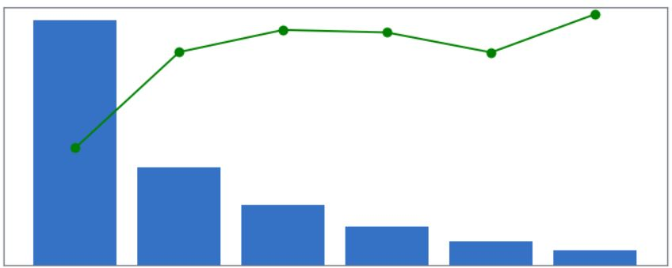
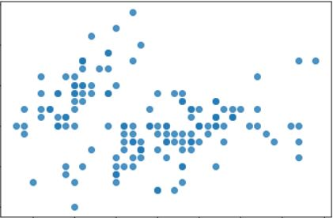
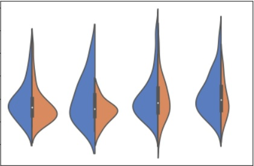
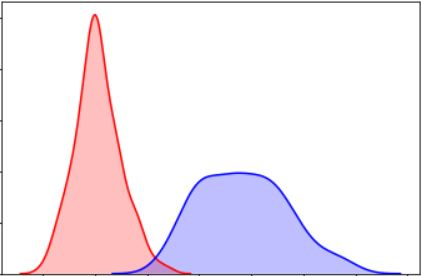
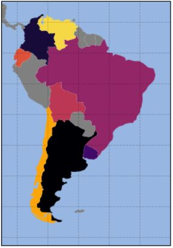

# visualization_catalog
This repository is a catalog for visualizations for Data Science Projects.
It is a research of the current libraries, it shows examples for them and lists pros and cons of each one.

## Type of graphs

### Complex

    

     

    <a href="./Complex/response_rate_and_distribution.ipynb">Response Rate and Distribution</a>

### Correlation

    

     

    <a href="./Correlation/scatter.ipynb">Scatter Plots</a> 

### Distribution

    

     

    <a href="./Distribution/violin.ipynb">Violin Plots</a> 

    

     

    <a href="./Distribution/density.ipynb">Density Plots</a> 

### Evolution
### Flow

### Maps

    

     

    <a href="./Maps/maps.ipynb">Map Plots</a> 

### Ranking

    

     

    <a href="./Ranking/bars.ipynb">Bar Plots</a> 

# Libraries

# Links