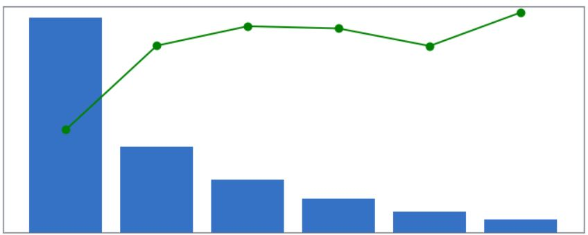

# visualization_catalog
This repository is a catalog for visualizations for Data Science Projects.
It is a research of the current libraries, it shows examples for them and lists pros and cons of each one.

## Type of graphs
- Complex
    
    - [Response Rate and Distribution](./Complex/response_rate_and_distribution.ipynb)
- Correlation
    - [Scatter Plots](./Correlation/scatter.ipynb)
- Distribution
    - [Violin Plots](./Distribution/violin.ipynb)
    - [Density Plots](./Distribution/density.ipynb)
- Evolution
- Flow
- Maps
    - [Map Plots](./Maps/maps.ipynb)
- Ranking
    - [Bar Plots](./Maps/bar.ipynb)

# Libraries

# Links