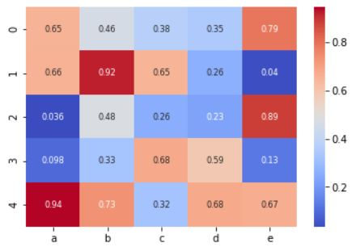
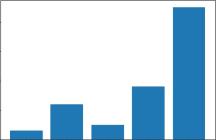

# Visualization Catalog
This repository is a catalog for visualizations for Data Science Projects.
It is a research of the current libraries, it shows examples for them and lists pros and cons of each one.

## Installation and running

```
git clone git@github.com:nicotom/visualization_catalog.git
cd visualization_catalog
./install.sh

conda activate visualization_catalog
jupyter notebook
```

## Type of graphs

### Complex
<div>
    <a href="./Complex/response_rate_and_distribution.ipynb"></a>
</div>
<br><br><br><br><br>
<div>
    <a href="./Complex/response_rate_and_distribution.ipynb">Response Rate and Distribution</a>
</div>

### Correlation
<div>
    <a href="./Correlation/scatter.ipynb"></a>
</div>
<br><br><br><br><br>
<div>
    <a href="./Correlation/scatter.ipynb">Scatter Plots</a><br>
</div>

<div>
    <a href="./Correlation/heatmap.ipynb"></a>
</div>
<br><br><br><br><br>
<div>
    <a href="./Correlation/heatmap.ipynb">Heatmap</a><br>
</div>

<div>
    <a href="./Correlation/pointplot.ipynb"></a>
</div>
<br><br><br><br><br>
<div>
    <a href="./Correlation/pointplot.ipynb">Pointplot</a><br>
</div>

### Distribution
<div>
    <a href="./Distribution/violin.ipynb"></a>
</div>
<br><br><br><br><br>
<div>
    <a href="./Distribution/violin.ipynb">Violin Plots</a><br>
</div>

<div>
    <a href="./Distribution/density.ipynb"></a>
</div>
<br><br><br><br><br>
<div>
    <a href="./Distribution/density.ipynb">Density Plots</a><br>
</div>

<div>
    <a href="./Distribution/histogram.ipynb"></a>
</div>
<br><br><br><br><br>
<div>
    <a href="./Distribution/histogram.ipynb">Histogram</a><br>
</div>

### Evolution
<div>
    <a href="./Evolution/line.ipynb"></a>
</div>
<br><br><br><br><br>
<div>
    <a href="./Evolution/line.ipynb">Line Plots</a><br>
</div>

### Maps
<div>
    <a href="./Maps/maps.ipynb"></a>
</div>
<br><br><br><br><br>
<div>
    <a href="./Maps/maps.ipynb">Map Plots</a><br>
</div>

### Ranking
<div>
    <a href="./Ranking/bars.ipynb"></a>
</div>
<br><br><br><br><br>
<div>
    <a href="./Ranking/bar.ipynb">Bar Plots</a><br>
</div>

<div>
    <a href="./Ranking/countplot.ipynb"></a>
</div>
<br><br><br><br><br>
<div>
    <a href="./Ranking/countplot.ipynb">Count Plots</a><br>
</div>

# Libraries
 - [Seaborn](https://seaborn.pydata.org/)
 - [Matplotlib](https://matplotlib.org/)
 - [Folium](https://github.com/python-visualization/folium)
 - [Bokeh](https://bokeh.pydata.org/en/latest/)
 - [Cartopy](https://scitools.org.uk/cartopy/docs/latest/)
 - [ggplot](http://ggplot.yhathq.com/)
 - [MPLD3](http://mpld3.github.io/)
